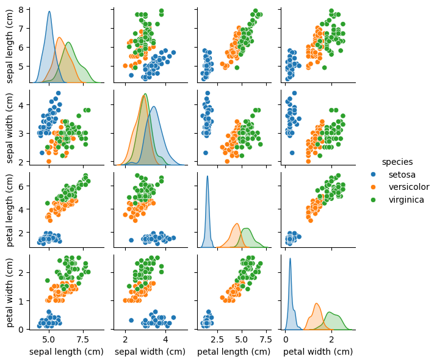

🌸 Iris Flower Classification

This project explores the classic **Iris dataset** using two classification algorithms: **k-Nearest Neighbors (kNN)** and **Naive Bayes**. It demonstrates the full machine learning pipeline from data loading and visualization to model training, evaluation, and comparison.

Objective

To build a simple classification model that can predict the species of an iris flower based on four measurements:  
- sepal length  
- sepal width  
- petal length  
- petal width

Methods and Tools

- Language: Python  
- Libraries: Pandas, NumPy, Seaborn, Matplotlib, scikit-learn  
- Models:  
  - k-Nearest Neighbors (kNN)  
  - Naive Bayes (GaussianNB)

Exploratory Data Analysis

- Used pairplot to visualize class separation  
- Observed that petal length and width are strong features for distinguishing species

Model Training & Evaluation

Data split: 75% train / 25% test
Evaluation metrics: Accuracy and F1-score

| Model        | Accuracy |
|--------------|----------|
| kNN          | 1.00     |
| Naive Bayes  | 1.00     |

Both models performed well, which is expected because Iris is a clean, well-separated dataset.

 Key Takeaways

- Both classifiers achieved high accuracy, showing that the Iris dataset is linearly separable in many cases.

 Project Structure
iris_classification_kNN_NaiveBayes/

├── iris_project.ipynb

├── README.md

├── images/

│ └── pairplot.png

---

About Me

👋 My name is Irina Vertiagina, and I'm studying AI and software development. I'm building a portfolio of machine learning projects — feel free to connect on LinkedIn https://www.linkedin.com/in/irina-vertiagina-70383a32a/

